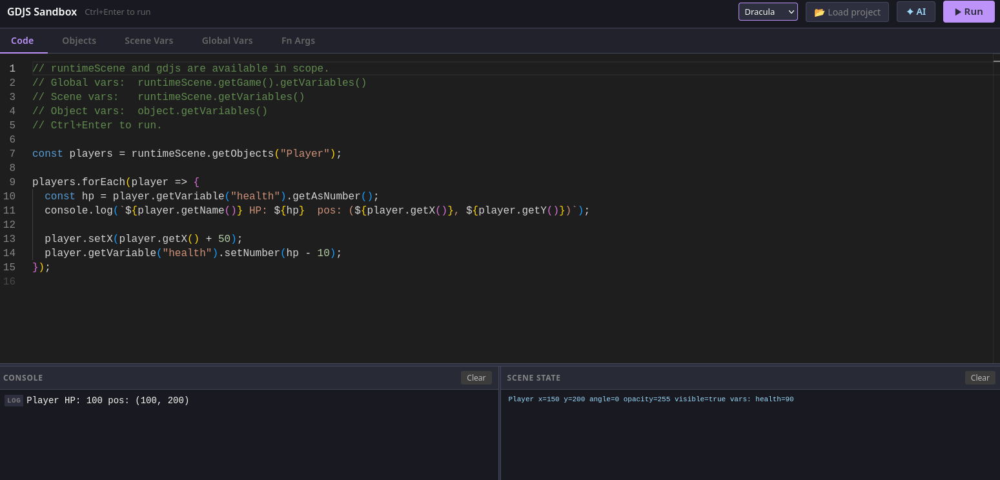

# GDJS Sandbox

A browser-based sandbox for writing and testing [GDevelop](https://gdevelop.io/) GDJS JavaScript snippets without running a full game.



## Why

GDevelop's normal feedback loop for JavaScript events is slow — write code → export/run game → trigger the event → observe result. This sandbox cuts that down to: write code → press Ctrl+Enter → see output instantly.

## Features

- **Monaco editor** with full GDJS autocomplete (`runtimeScene`, `gdjs`, `eventsFunctionContext`, all runtime object methods)
- **Mock runtime** — `RuntimeGame`, `RuntimeScene`, `RuntimeObject`, `Variable`, `VariablesContainer`, `TimeManager`
- **Objects tab** — add mock objects with position, size, angle, opacity and per-object variables
- **Scene Vars / Global Vars tabs** — mock scene and global variables (number, string, boolean, structure, array)
- **Fn Args tab** — mock `eventsFunctionContext.getArgument("name")` for testing event function extensions
- **Split console** — log output on the left, scene state snapshot on the right after each run
- **AI assistant** — Claude writes GDJS code based on your prompt; reads and edits the current editor content
- **Load project** — import a `game.json` (or folder project) to auto-populate objects and variables from a real scene
- **Resizable panels** — drag handles on the console and AI sidebar
- **5 colour themes** — Dark, Dracula, Nord, Monokai, Solarized
- **State persistence** — editor content, mocks, and settings survive page refresh
- Single HTML file, no build step

## Getting started

```bash
# Serve from localhost (required for the AI proxy; also avoids browser file:// restrictions)
python3 -m http.server 8080 --directory gdjs-sandbox
# then open http://localhost:8080
```

Or just open `index.html` directly in a browser if you don't need the AI assistant.

## AI assistant

Two modes, switchable in the AI panel:

### Claude Code (local) — recommended

Requires [Claude Code](https://claude.ai/code) to be installed and authenticated.

```bash
python3 gdjs-sandbox/proxy.py
```

The proxy listens on `http://127.0.0.1:3001` and forwards prompts to the `claude` CLI.

### Anthropic API key

Enter a `sk-ant-…` key directly in the panel. The key is stored in `localStorage`. Requires serving from `localhost` to avoid CORS errors.

## Usage

### Running code

`runtimeScene` and `gdjs` are always in scope. `eventsFunctionContext` is available when you have Fn Args defined.

```js
const players = runtimeScene.getObjects("Player");
players.forEach(p => {
  p.setX(p.getX() + 10);
  console.log(p.getName(), p.getX());
});
```

Press **▶ Run** or **Ctrl+Enter**. The Console pane shows `console.log` output; the Scene State pane shows object positions and variable values after the run.

### Fn Args (event function extensions)

Add arguments in the **Fn Args** tab, then access them in code:

```js
const tier = eventsFunctionContext.getArgument("Tier");   // gdjs.Variable
const out  = eventsFunctionContext.getArgument("Result"); // gdjs.Variable

// Variables support direct numeric comparison via valueOf()
if (tier >= 2) {
  out.setString("rare");
}
```

### Loading a real project

Click **📂 Load project** and select your GDevelop project folder (works with both single-file `.json` and folder projects). Choose a scene and click **Import scene** to populate objects and variables from your actual game. The project is cached in `localStorage` so it survives refresh.

## File structure

```
gdjs-sandbox/
├── index.html   # entire app — editor, mock runtime, UI, AI panel
└── proxy.py     # local Claude Code proxy (optional)
```

## Keyboard shortcuts

| Key | Action |
|-----|--------|
| Ctrl+Enter | Run snippet |
| Ctrl+Enter (AI prompt) | Send to Claude |
